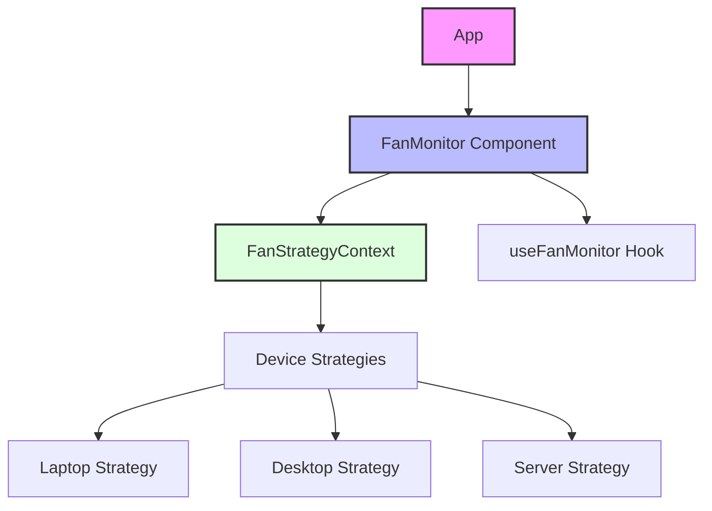
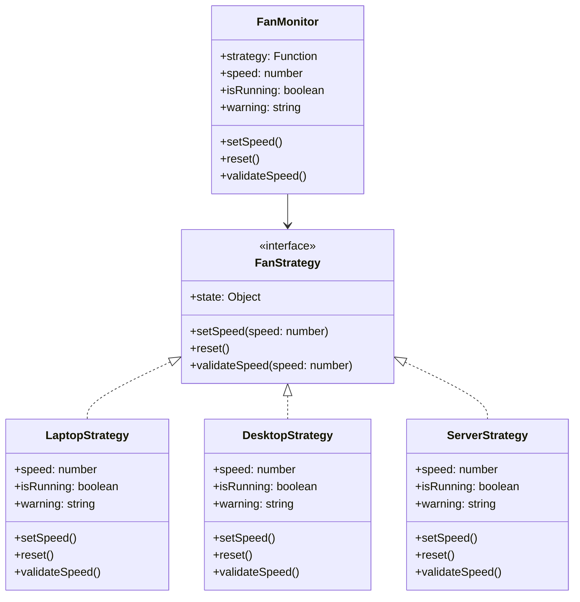
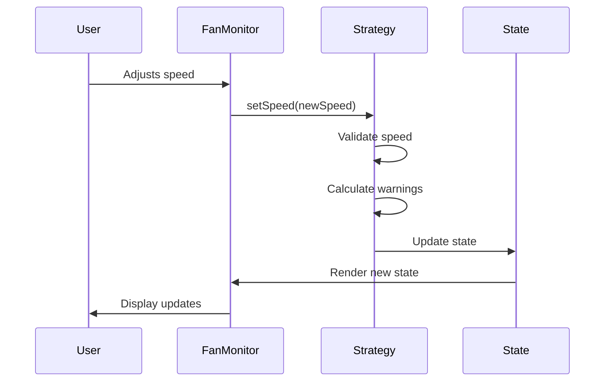

# Functional Strategy Pattern Implementation

This project demonstrates the implementation of the Strategy pattern using React and functional programming principles. It showcases how different fan control strategies can be implemented for various devices (laptop, desktop, server) while maintaining a consistent interface.

## Architecture Overview

The project uses React with Vite and implements different state management approaches (Redux, useReducer, useState) to showcase various ways of handling state in a React application.



## Component Structure



Types should be enforced for the `FanStrategy` interface and the `LaptopStrategy`, `DesktopStrategy`, and `ServerStrategy` classes. We can use TypeScript or JSDoc for type checking.

## Implementation Details

### Strategy Pattern Implementation
Each device type (laptop, desktop, server) implements its own fan control strategy with unique characteristics:

1. **Laptop Strategy**
   - Uses Redux for state management
   - Focuses on power consumption
   - Speed range: 0-10
   - Includes battery-related warnings

2. **Desktop Strategy**
   - Uses useReducer for state management
   - Focuses on noise level
   - Speed range: 0-8 (limited for noise control)
   - Includes noise-related warnings

3. **Server Strategy**
   - Uses useState for state management
   - Focuses on temperature management
   - Speed range: 0-10
   - Includes temperature-related warnings

### Key Features

- **Consistent Interface**: All strategies implement the same interface with:
  - state (speed, isRunning, warning)
  - setSpeed()
  - reset()
  - validateSpeed()

- **Context-Based Strategy Selection**: Uses React Context for strategy injection
- **Flexible State Management**: Demonstrates different React state management approaches
- **Warning System**: Each strategy implements device-specific warnings
- **Speed Validation**: Custom speed validation rules per device type

## State Flow



## Technical Stack

- React + Vite
- Redux (Laptop strategy)
- React Hooks (useReducer, useState)
- PropTypes for type checking
- Modern JavaScript (ES6+)

## Project Structure

```
src/
├── components/
│   └── FanMonitor/
│       ├── FanMonitor.jsx
│       ├── FanStrategyContext.jsx
│       └── useFanMonitor.js
├── devices/
│   ├── laptop/
│   │   ├── LaptopFan.jsx
│   │   └── laptopFanStrategy.js
│   ├── desktop/
│   │   ├── DesktopFan.jsx
│   │   └── desktopFanStrategy.js
│   └── server/
│       ├── ServerFan.jsx
│       └── serverFanStrategy.js
└── App.jsx
```

This implementation showcases how the Strategy pattern can be effectively implemented in a React application while maintaining clean code principles and leveraging modern React features and patterns.
